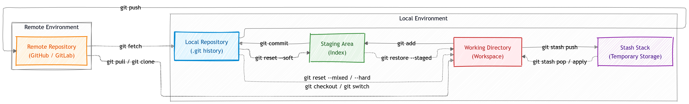
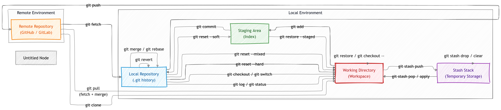

# git-visual

Visual diagrams that explain Git commands and data flow – from working directory to remote repository.

## Diagrams

| Mermaid Source | Description | Preview Image |
|----------------|-------------|---------------|
| [`git-basic.mmd`](git-basic.mmd) | Core workflow: add, commit, push, fetch/pull, and stash basics | [git-basic.png](image/git-basic.png) |
| [`git-visual.mmd`](git-visual.mmd) | Extended operations: reset, restore, revert, merge, rebase, and more | [git-visual.png](image/git-visual.png) |

Both source files use [Mermaid](https://mermaid.js.org/). For best viewing or editing, use a Mermaid‑supported viewer. Rendered static images are also available in the [`image/`](image/) folder.

## Previews

### Core Workflow (`git-basic.png`)

### Extended Operations (`git-visual.png`)

---

For interactive learning, also checkout [LearnGitBranching](https://github.com/pcottle/learnGitBranching).

For git command documentations, visit [Git Cheat Sheet](https://git-scm.com/cheat-sheet).

## License

Public domain (Unlicense). No restrictions, no warranty.
